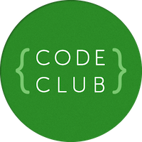

Python CodeClub experiments
============================



This repository contains some experiments in producing a Python CodeClub curriculum
using PyGame and, I hope eventually, networked games.

Checking this out and modifying it
-------------------

Most importantly: how to contribute!

1. Ensure you have a github account
2. Click the Fork button above (assuming you're reading this online)
3. You will get your own copy of it all stored on github (with the exception of the code for the exercises - more on that in a moment)
4. ```git clone``` as per the github instructions. _But_ use ```--recursive``` too, for reasons shown below.
5. On your computer, edit, ```git commit```, ```git push``.
6. You should see the results on your own github page.
7. Let me know and I'll merge the changes back into my repository. This is trivial with github. If you want an easy way to ask me, click the Pull Request button. Or, if anyone else wants to act as the master repository, that's fine too.

However there is one thorn in the side: the code for the exercises uses something called "submodules". This means the main git repository just contains references to other git repositories for the code. The reasoning behind this is explained under the rationale section, below. But for you it has some implications:
* When doing ```git clone``` you will need to type ```git clone --recursive``` to fetch the exercise code as shown above.
* When you do a fork, you will just be forking the main repository not the code for the exercises. You can fork them too of course - please do - but you'll have to click the Fork button separately, and you'll need to do ```git remote add my-fork some-github-url-here``` to point your local copy to your new github repository then ```git push my-fork master```.

All of those concerns only apply to the submodules containing the exercise _code_, not their documentation nor the central docs.

Motivation: why Python?
---------

Actually, none. Scratch is great and just right for kids of this age. However, existing CodeClub wisdom seems to be that two terms of Scratch is enough, and we should move to more 'advanced' languages.

There's a third term of HTML but after that we should probably go back to real imperative programming, and Python is the choice.

Will the kids want to do Python?
------------------------

General view of Python has been quite negative in comments in the class: terms like 'boring'. But I asked at my CodeClub session today whether the kids wanted to move to Python, because "it can do much more stuff" but "is much more difficult". The response was categorically a yes.

However, I do think many of the kids will struggle. It is _much_ more difficult no matter which way you cut it.

Hence we need to provide some real solid motivation for the kids to move to Python. I think we therefore need to do one of three things which can't be done in Scratch:

* Robotics.
* Physics.
* Networked games.

Initially I'm aiming for the latter as it's much easier.

The 'Desert Race' Scratch example was very popular because it was two-player, albeit on the same PC. If we can come up with a genuine way to get the kids producing networked multi-player games I'm sure they will definitely feel the move to Python was worth it.

That said, I also happen to have a Parrot AR.Drone which has a Python SDK so I haven't totally given up on the robotics angle :-)

Exercises
---------------------------------------

* [Py01-Ball](exercises/Py01-Ball/docs/README.md):

  The first exercise is for the kids to be talked through Python to pick up some basic syntax. There is a single challenge for them to do, but really they're just typing what they're told.

* [Py02-Alien](exercises/Py02-Alien/docs/README.md):

  A big Python project can look daunting. The intention here is that the kids are faced with a big file of code, but all they have to do is look through it to spot clues. And they get a fun game to play. If we can end the session with an idea that a 'class' relates to a sprite on the screen, we're doing well.

* [Py03-Guess](exercises/Py03-Guess/README.md):

  In this exercise (prepared by Pete Lewin) the kids write their first Python program from scratch (boom boom). It's a textual number guessing game.

* [Py04-Felix](exercises/Py04-Felix/docs/README.md):

  This exercise has been produced by Peter Lewin and I think it slots pretty well after the ball and alien, as they actually have to do stuff here (instead of, mostly, just looking through the code as with the Alien exercise). We might want to adjust it so that they have to do slightly more. Perhaps.

* Additional unwritten Scratch project conversion, or two. Definitely graphical PyGame stuff is needed.

* [Py06-ChatRoom](exercises/Py06-ChatRoom/docs/README.md):

  A networked chat room.

* [Py07-Airport](exercises/Py07-Airport/docs/README.md):

  A network game.

Future developments could include a simple physics library but I think a term will be pretty full with all the above.

Other resources
------

* Setup: I've added some notes in [a separate document](setup/setup.md). It's horrendous.
* [Rationale for use of github/PyCharm/etc](setup/rationale.md)
* There are some [highly provisional coding standards here](docs/code-guidelines.md).
* [Central repository for the ```codeclub.py``` module which is used in many exercises](common-code/codeclub.py)

License 
-------

Adrian's bits are provisionally licensed under CC BY-NC-SA. This is slightly less restrictive than the Scratch CodeClub material which is CC BY-NC-ND (i.e. no derivatives, versus ShareAlike). Adrian can be convinced to relicense under CC BY-NC-CD if that's seen as important.

To do
------

(Non-exhaustive!)

* Create Scratch-Python conversion guide. (Not just the blocks, but also sprites, sounds, variables and broadcasts. There's a [start at this here, but it's incomplete](docs/scratch-python-cheatsheet/README.md). Tim Morley has volunteered to format it nicely once we've got the information in place. We need to do the merge of Pete Lewin's ```codeclub.py``` module first - see below.
* Work out the best way to check out a certain branch within PyCharm.
* Think about whether PyCharm is truly the best IDE for the job. An open-source one would be better...
* Match styles between exercises.
  * Use Peter's nice ```codeclub.py``` in all the exercises.
  * Modify Pete's Felix exercise to include classes since Ade's prior exercises introduce the concept.
  * Modify Ade's exercises to use a ```main``` function since that seems to be best practice and Pete's exercises do it
  * In general make Peter and Ade's stuff more consistent.
  * Change all spaces to tabs.
* Test each exercise on a variety of hardware. Especially the networked one
* Figure out a simple physics-based exercise??
* See the 'TODO' items for each individual exercise.
* Produce at least one more exercise which repeats one of the Scratch exercises the kids have done already.
* Produce the last two or three exercises which Ade thinks should be a networked game involving physics, possibly spread over more than one session.
* Help more people check this out and make it better.
* Make the setup procedures sane.
  * They don't even mention Pyro yet
  * There are too many things to install
  * There might be dependencies on git and ssh that I haven't figured out
  * Some of this could be avoided if we switched to Eclipse/PyDev which has a pure-Java git plugin, but it just appears to be plain rubbish. See IDE TODO item above.

Possible future projects
---------------

Some of these look quite good as inspiration:
* http://www.freewebs.com/silacron/games.htm (only 192 simple lines; has computer opponent; could be converted to be a network game perhaps)

