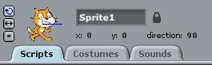
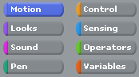
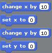
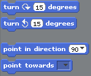

Scratch-Python cheat sheet
==========================

Here's a conversion from Scratch to Python and PyGame.

It assumes you're using `codeclub_pygame_handy_functions.py`.


------------

```python```
surface = pygame.image.load("c:\SomeFolder\SomeImage.png")
```
but this requires a complete file location so you might prefer
to do this:
```python
surface = codeclub_pygame_handy_functions.load_image_from_data_directory("SomeImage.png")
```
to use an image in a folder called 'data' in the same place
as your script.

To draw your own image, you can use Windows' built-in Paint program or use [Paint.NET](http://www.getpaint.net/).


--------

* There might be lots of sprites of the same class (that is, the same behaviour).
* To create a class of sprite called 'MyClassOfSprite':
```python
class MyClassOfSprite(pygame.sprite.Sprite):
```
* To create a couple of these:
```python
my_first_sprite = MyClassOfSprite()
my_second_sprite = MyClassOfSprite()
all_sprites_list.add(my_first_sprite)
all_sprites_list.add(my_second_sprite)
```
* To print out the location of the sprite:
```python
print my_first_sprite.rect
```
* For fixing the image orientations, see 'direction' below


------------------

* Duplicating sprites: just create two instances of the same sprite class:
```python
my_first_sprite = MyClassOfSprite()
my_second_sprite = MyClassOfSprite()
all_sprites_list.add(my_first_sprite)
all_sprites_list.add(my_second_sprite)
```
* Deleting sprites: just delete the line of code where you create a sprite.
* Shrinking and growing sprites: ask pygame to grow or shrink the image before creating the sprite.
```python
my_smaller_image = pygame.transform.smoothscale(my_original_image, (45, 65)) # 45,65 is new width, height
```


-----------------

* Scratch has a small list of things you can do in scripts. In Python, it's endless! You need to look on the Internet to find out what's possible and what to type.
** (Games, sprites, images, and sounds - look at Pygame)[http://www.pygame.org/docs/]
** (Main Python language, variables, classes, functions)[http://docs.python.org/2/]

  
-----------------

* Python doesn't know the 'direction' of a sprite. Instead move its 'rectangle':
```python
self.rect.move_ip(steps_to_move_right, steps_to_move_up) # use minus numbers to move left or down.
self.rect = self.rect.clamp(screen_rect) # good idea to make sure sprite doesn't go off the screen
```


-----------
```python
my_sprite.rect.x = 30
some_other_variable = my_sprite.rect.y
```

 
-------------
* Python and Pygame don't have a built-in concept of the direction of a sprite. You can [rotate the direction an image points](http://www.pygame.org/docs/ref/transform.html#pygame.transform.rotate):
```python
my_image = codeclub_pygame_handy_functions.load_image_from_data_directory('ball.png')
my_rotated_image = pygame.transform.rotate(my_image, 180) # rotates 180 degrees
```
If you want your sprite to point towards something else, you could do this:
```python
class MyClassOfSprite(pygame.sprite.Sprite):

    def __init__(self):
		    super(MyClassOfSprite, self).__init__()
				self.original_image = # some image
				self.image = self.original_image
				self.rect = # starting rect
				self.direction = 0 # starting direction

    def point_in_direction(self, my_direction_in_degrees):
        self.direction = my_direction_in_degrees
        self.image = pygame.transform.rotate(self.original_image, self.direction)
```
You can print the direction of the sprite any time using ```print my_sprite.direction```. Calculating the angle you need to point towards another object, or towards the mouse pointer, is _quite difficult maths_ and ask your CodeClub guide for help. (TODO: improve this answer with something in the utils class).

TODO: if on edge bounce
