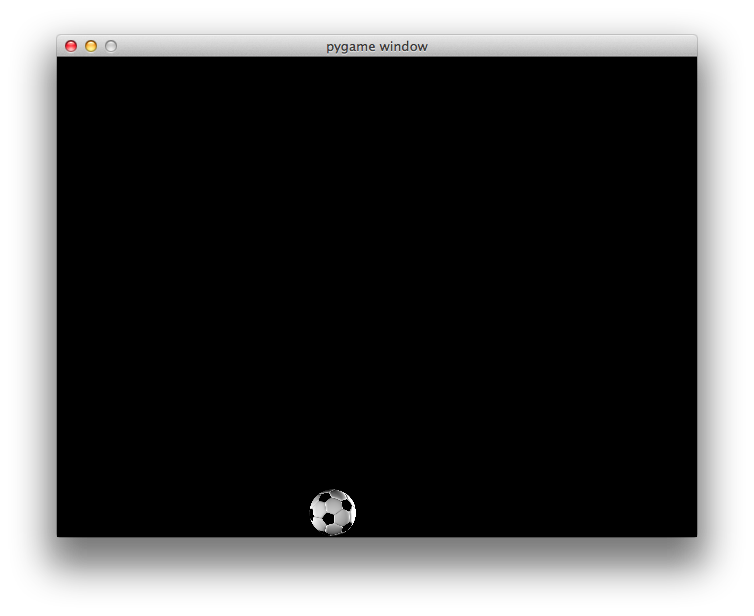

Py01: Ball
==========

This exercise gives a very simple 'game' where you can move a ball around the screen.

For the first half of the exercise, you'll be copying out code to make the game work.

For the second half, there's a challenge.

Part One: Writing the game
--------------------------

Just do what the guide tells you!

Challenge One
-------------------

You can only move the ball left and right, using the left and right keys.

Improve the game so you can move it up and down as well.

Challenge Two
--------------

Add another ball. Use the keys I and K to move it up and down, and J and L to move it left and right.

The key codes you need are:
* `K_j`
* `K_l`
* `K_i`
* `K_k`

Hint: you do _not_ need to add a new `class`.
