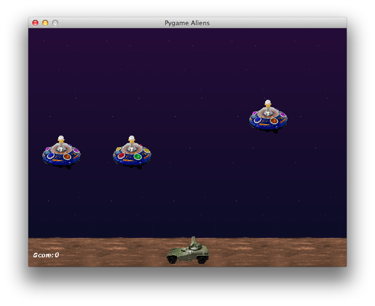
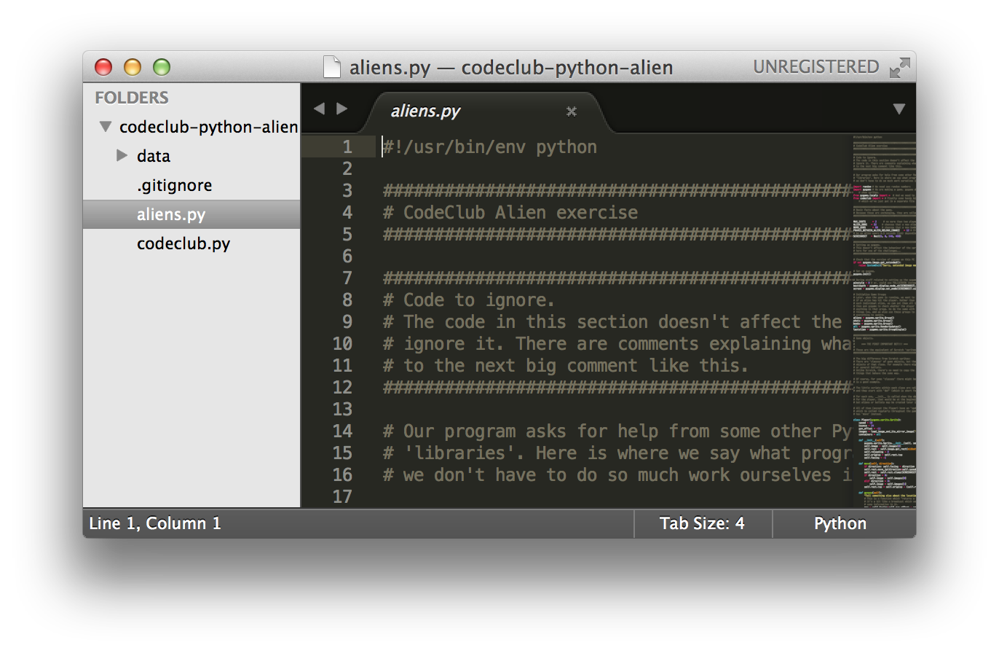
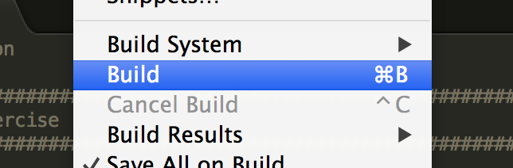

Py02 – Alien
============

Introduction
------------
This game is a classic Space Invaders-style game where you shoot aliens who try to drop bombs on you.



Step 1: Get the code and run the game
-------------------------------------

We're going to work on an existing game, and make small changes to it. So first of all
you need to get the game code from the Internet.

This will seem complicated - that's because you're using the same tools as professional software developers who have put together all the apps and games that you use every day. You're not taking any shortcuts here.

1. Open a Command Prompt (your guide will show you how)
2. Move to the location where you want to keep the code (again, your guide will show you how)
3. Type `git clone -b py02-problem https://github.com/adetaylor/codeclub-python-alien.git` and press return.
4. This will create a folder entitled `codeclub-python-alien`
5. In Sublime Text, Open that folder.

You now have the game code on your computer. Next, we'll look at the code and run the game.

1. Double-click `aliens.py`
2. You should see the game code. It looks long and terrifying, but don't worry, we'll help you through it.
   
3. To play the game, go to the `Tools` menu and select `Build`.
   
 
Step 2: Play the game and take some notes
-----------------------------------------
Play the game a couple of times. To do this, choose Run – Run from the menus at the top of the PyCharm window.

What kinds of objects can you see? Make a list of all the different objects you see in the game:

_______________________
_______________________
_______________________
_______________________
_______________________
_______________________

For some of these kinds of objects, there might be several on the screen at once. For others, there’s always exactly one. Put a star next to the objects where there might be several of them.

Step 2: Find the different classes of object in the code
--------------------------------------------------------

Look through the code for lines which follow this pattern:

```python
class something(pygame.sprite.Sprite)
```
Where "something" is obviously something, as opposed to ‘something’.

Each of those matches one of the objects you already wrote down. Write down the exact name of the class, given in the code, next to the list you already made.

*  Did you miss any in your list?

Step 3: Which images are used by each type of sprite?
-----------------------------------------------------
You can see the different image files in the "data" directory. Which kinds of sprite use each file?

* alien1.gif	
* alien2.gif	
* alien3.gif	
* background.gif	
* bomb.gif	
* explosion1.gif	
* player1.gif	
* shot.gif

Are any of the images not used by a sprite? How are they used?

Are any of the images flipped over?

Step 4: Make the aliens move more slowly
----------------------------------------
I can’t score above 11. The aliens are too good.
* Make the aliens go a bit slower.

Step 5: Make the explosions last twice as long
----------------------------------------------
*	Make the explosions appear on the screen for twice as much time.

Step 6: Change the colour of the ‘Score’ text to blue
----------------------------------------------

1.	Make the colour of the score blue instead of white.
2.	Make the font size a bit bigger.
3.	Stop it from being italic (_slanty text like this_).
4.	Make it **bold** instead.

Step 7: Make the game full-screen
---------------------------------
Work out how to make it full-screen. You may need the hints below:

* Hint 1: first find the bit of the program where we’re asking pygame to create a window.
* Hint 2: code starting with `#` means it is just a "comment" – that means, it’s for human beings (you!) to read, not for the computer.
* Hint 3: sometimes such comments contain bits of code you could use instead…

Step 8: Change it so that a randomly chosen alien drops bombs, not just the last alien
-----------------------------------------------------------------
This is hard. Don’t worry if you can’t do it.

In the game at the moment, only the last-created alien drops bombs, not all of them. Change this so that any alien can drop bombs.

* Hint 1: you will no longer need to remember the ‘lastalien’. You can get rid of all the mentions of ‘lastalien’.

* Hint 2: You will need to add this near the top:
```
from random import choice
```
And somewhere else you’ll need:
```
Bomb(choice(aliens.sprites()))
```
