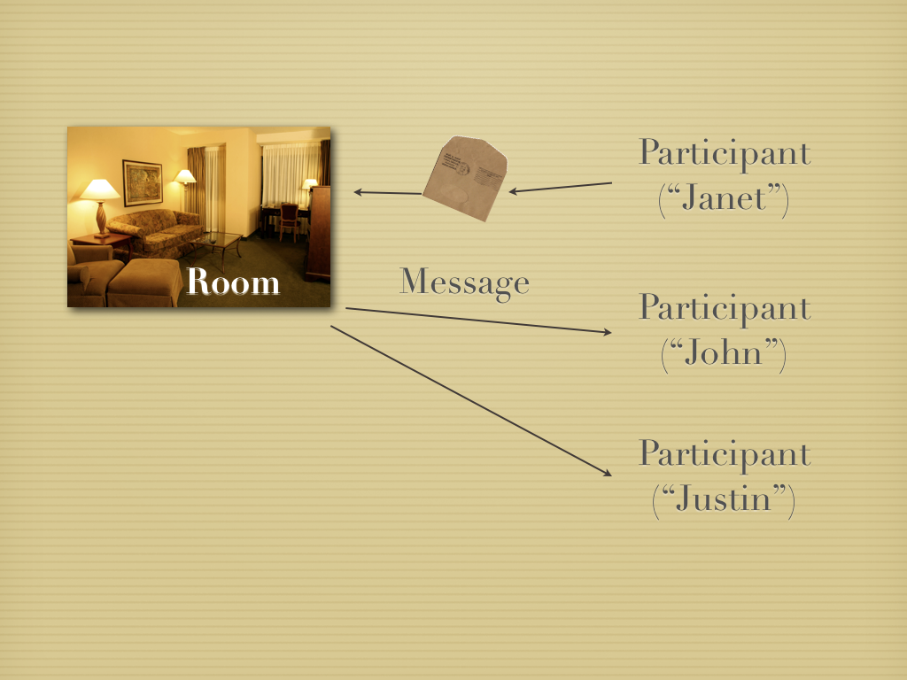

Py06 – Chat Room
============

Introduction
------------
This isn't a game! But it's nearly as good. You're going to create a chat room to talk to your classmates across the computer network.

Step 1: Create classes for the chat room, messages, and participants
-------------------------------------

1. Create a new project in PyCharm.
2. Create three new files - called `message.py`, `room.py` and `participant.py`.
3. `room.py` contains a class representing a chat room:

   ```python
   class Room:
	   def __init__(self):
		   self.participants = []
	   
	   def add_participant(self, participant):
		   self.participants.append(participant)
	   
	   def say(self, message_text):
		   for p in self.participants:
			   p.heard(message_text)
   ```

   Notice how it's a class, but _not_ a sprite. Classes can be any sort of 'object' or 'thing' in your program - not necessarily something you can visibly see on the screen. In this case, it's a room in which people can chat.

   The room starts with an empty list of participants - but they can be added using `add_participant`. Each time somebody `say`s something, it gets sent to each of the participants. That's what a chat room is!

4. `participant.py` represents somebody who is in a chat room:

   ```python
   class Participant:
	   def __init__(self, room):
		   self.room = room
	   
	   def say(self, message):
		   self.room.say(message)
	   
	   def heard(self, message):
		   print(message.get_message_text() + "\n")
   ```

   What happens when a participant `say`s something? What happens to the message? Does it end up within `heard`? How?

	 ----------------------
	 ----------------------
	 ----------------------
	 ----------------------
	 ----------------------

5. Finally `message.py` is the message. You should:
   * Add a class called `Message`.
	 * Add an `__init__` method which is given `self` as normal, but also takes an extra variable called `message_text`. It should store the message text in `self.message_text`.
	 * Add a method called `get_message_text` which does this:
	   ```python
		 return self.message_text
     ```

	 Can you see what calls `get_message_text`?

	 -----------------
	 -----------------
	 -----------------
	 -----------------

Step 2: Try it out on your own computer
-----------------------------------------

1. Add another file called `simple.py` which looks like this:

   ```python
   from room import Room
   from message import Message
   from participant import Participant
   
   room = Room()
   janet = Participant(room)
   room.add_participant(janet)
   john = Participant(room)
   room.add_participant(john)
   justin = Participant(room)
   room.add_participant(justin)
   
   first_message = Message("Hello everyone!")
   
   janet.say(first_message)
   ```

   Before you run it - what do you expect? How many times do you expect to see "Hello everyone!" appear on the screen?
   
   -------------------
   -------------------
   -------------------
   -------------------
   
2. Run it. Does it do what you expect?

3. Why do you think we have tried it out on just one computer? It's not very useful.
   
Step 3: Make it work between several computers
--------------------------------------------------------

We want it to work like this:



We want the *room* to be on one computer, and each *participant* to be on different computers. The *messages* will be sent across the network from a participant to the room, then sent out to each of the other participants.

(In computing terms, the room is the "server" and each participant is a "client").

1. To make contact over the network, we're going to rely on another program called `Pyro4`. Add this code to the top of `room.py`:

   ```python
   import Pyro4
   ```

2. Then at the bottom of `room.py` add this:

   ```python
   room = Room()
   
   daemon = Pyro4.Daemon()
   ns = Pyro4.locateNS()
   uri = daemon.register(room)
   ns.register("example.room", uri)
   print "Chat room available and ready for connections!\n"
   daemon.requestLoop()
   ```

   You don't need to understand that... except that these magical objects called `ns` and `daemon` make the `room` available to other computers on the network.

3. Run `room.py`. It should say "Chat room available and ready for connections!" Leave it running on *one* computer.

4. In `participant.py`, we need to make even more complicated changes. Add this at the top:

   ```python
   import sys
   import Pyro4
   import threading
   from message import Message
   ```

5. And add this at the bottom:

   ```python
   sys.excepthook=Pyro4.util.excepthook
   room=Pyro4.Proxy("PYRONAME:example.room")
   daemon = Pyro4.Daemon()
   me=Participant(room)
   uri = daemon.register(me)
   room.add_participant(uri)
   
   t = threading.Thread(target=lambda: daemon.requestLoop())
   t.daemon = True
   t.start()
   
   while True:
	   text = input().strip()
	   message = Message(text)
	   me.say(message)
   ```

6. Finally - all your friends should run `participant.py`. You should be able to chat to each other!

Challenge 1: Print the user name
--------------------------------

* It's not clear who is saying what. How can you modify things so that each message says who it's from?
* Hint 1: `participant.py` should ask the user for their name when it starts up, and store it in a variable (for example, `username`).
* Hint 2: `message.py` only right now stores the message text. Improve it so that it also stores the username that the message comes from (for example, add `self.username`).
* Hint 3: `participant.py` `heard` will need to print the username as well as the message contents.

Challenge 2: Don't print your own messages
------------------------

(Make sure you've done Challenge 2 first!)

* Hint 1: The message object says who the username is that sent the message.
* Hint 2: You know who you are.
* Hint 3: To check if two bits of text are the different, do this:

  ```python
	if not oneBitOfText is anotherBitOfTextt
		do_something()
	```

Challenge 3: Multiple rooms
---------------------------

* All of you are chatting on the same room. Change it so that there are two rooms.
* Hint 1: Change `example.room` in both places.
* Hint 2: Don't forget that *two* computers will need to run `room.py`.

Challenge 4: Work out why a 'thread' is necessary
--------------------------

A "thread" means your program can do two things at once.

In `participant.py` we need to create another thread. That's because the main part of the program is always waiting for the user to type a message. So, why do we need another thread? What could it be doing?

------------------------
------------------------
------------------------
------------------------
------------------------
------------------------

