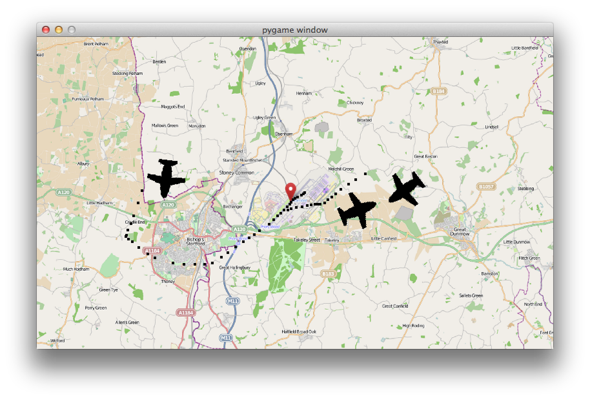

Py07 - Airport
===============

You'll be making a network game where you all try to land aeroplanes on one runway without crashing.

It should take about three weeks.

Week One
=========


This week we're going to make planes fly across the screen. In later weeks, we'll enable you to land the planes - and then make it into a network game.

Stage 1 - a blank airport
-----------------

* Fetch the code from `git@github.com:adetaylor/codeclub-python-airport.git` branch `airport-problem`. Your guide should be able to show you how to do this, if you haven't done so in previous exercises.
* Create a new Python file called `airport.py`.
* In this class, create a class of sprites entitled `Plane`. This should be a type of `CodeClubFreeRotatingSprite`, and its `__init__` method needs to take an additional parameter called `screensize`:

```python
class Plane(codeclub.CodeClubFreeRotatingSprite):
        def __init__(self, screensize):
                codeclub.CodeClubFreeRotatingSprite.__init__(self)
                self.set_costume('plane_icon.png', 60)
                X_MAX = screensize[0]
                Y_MAX = screensize[1]
                # TODO - we'll fill in the rest of this __init__ method later
```

* After the class, fill in the main body of the game like this:

```python
def main():
        pygame.init()
        screensize = (800, 483) # You can multiply these numbers by 1.5 if your screen is big
        screen = pygame.display.set_mode(screensize)

        wallpaper = codeclub.load_image('stansted-map.png')
        wallpaper = pygame.transform.scale(wallpaper, (screensize))

        plane = Plane(screensize)
        allplanes = pygame.sprite.Group((plane))

        clock = pygame.time.Clock()

        while True:
                clock.tick(60)

                for event in pygame.event.get():
                        if event.type == QUIT:
                                return
                        elif event.type == KEYDOWN and event.key == K_ESCAPE:
                                return

                # TODO - move the plane

                screen.blit(wallpaper, (0, 0))
                allplanes.draw(screen)
                pygame.display.flip()

if __name__ == '__main__': main()
pygame.quit ()
```

* Run the game. What happens?
* Now add instructions for the plane to move where you've already typed `TODO - move the plane`. All types of CodeClub sprite have a method called `move` which takes a single parameter: the distance to move. This doesn't have to be a whole ("integer") number: it can be something like 0.5, 1.5, 3.674 or whatever you want. Pick some speed which you're happy with: you can change it later.
* Run the game. What happens now?

Stage 2 - Starting from a random location
---------------

The plane is starting in the corner. Let's fix it to start _anywhere on any edge of the screen_. You'll do this by adding code to the Plane's `__init__` method.

* Pick a random side of the screen to start on. (`edgenumber = random.choice((0,1,2,3))` might be what you want... don't forget you can use `print edgenumber` to find out what you got).
* Fill in two variables `x` and `y` to pick a random location along the edge. Hints:
  * You'll need to use `if edgenumber == 1:` and similar.
  * You'll need to use `X_MAX` and `Y_MAX`. If you're not sure what they are, look where the parameter to the `__init__` method comes from - when you create the `Plane` sprite in the main part of the script.
  * To pick a random number between 0 and, say, `Y_MAX` then use `y = int(random.random() * Y_MAX)`. Wrapping it up in `int(...)` means that you get a 'whole' number such as 3 or 55, not a fractional number such as 3.7 or 55.234.
* Move the plane to the right place using `self.move_to((x, y))`. We're using "self" because the script we're writing belongs to the plane - so the plane itself is telling itself to move.
* Test the game. It should start at a random location on any edge of the screen. It will still always fly left, but we'll fix that left.

Stage 3 - Flying into the screen
-----------------

Now we'll fix it so that the place flies into the middle of the screen. Again, you'll do this by modifying the Plane's `__init__` method.

* Create a new variable called `direction`. This should contain the direction (in degrees) where the plane should point. **Important:** 0 degrees is pointing *left*.
* Set the value of this variable depending on the side where the plane starts. We want it to choose a random direction between 0 and 180 degrees, but always pointing _into_ the map.
* For example, if the plane is on the left edge of the screen, we want to choose an angle from 90 to 270.
* Call `self.point_in_direction(direction)` to set the direction.
* Test the game. We should see a plane starting on one edge and flying across the screen in a random direction.

Week Two
========

This week we'll add several planes and get them to crash.

Stage 4 - Adding more planes
-----------------

One plane is a bit dull. Let's add more.

* Add a new variable near the top of your `main` function like this: `chance_of_new_plane_in_next_tick = 0.001`
* In the loop, _perhaps_ create a new plane like this:

```python
if random.random() < chance_of_new_plane_in_next_tick:
```

* Within the body of the `if` you need to create a new plane and add it to the `allplanes` group.
* Test your game. Every time through the loop, there should be a 1-in-1000 chance that a new plane appears.
* Now to make the new planes move. On the original plane, we called `plane.move(1)` but that's no good now there are lots of them. Instead, we call `allplanes.update()` which will call an `update` function for each sprite in that group. To do this:
  * Replace the `move` call with `allplanes.update()`
  * In the `Plane` sprite, add a new method called `update` (you want `def update(self):`) which, inside, calls `self.move(1)`.
* Test your game. Do the planes all move?
* Sometimes, planes start too close to each other and crash straight away. Stop this.
  * Hint: Perhaps you can set `chance_of_plane_in_next_tick` to a low value every time a new plane is created, and increase it in an `else` block?
* Depending on how you did this, you may be able to remove the original lines creating the very first plane.
* Test your game. Hopefully the planes are created with sufficient gap that they rarely crash immediately.

Stage 5 - Exterminating old planes
---------------------

* In the main loop, add a line like this:

```python
print "Number of planes is ",len(allplanes)
```

  Does the number reduce when the planes go off the screen? It doesn't. This is a problem because it means the computer will get **slower** and **slower** keeping track of lots of planes.
* Add this to the plane's `update` method:
```python
if not self.rect.colliderect(self.area):
    self.kill()
```
  (This is rather complicated, but the CodeClub sprites keep track of the overall screen area within their own "area" variable. So it is just checking that some part of the plane's rectangle touches, i.e. collides, with some part of the screen area).
* Does this fix the problem? If so, remove the `print` line.

Stage 6 - Planes crash!
---------------

* After the place you call `allplanes.update()`, add this code:

```python
for planea in allplanes:
	for planeb in allplanes:
		if pygame.sprite.collide_mask(planea, planeb):
			return
```

* Test it. What goes wrong? Look carefully at the code you've just added. Can you fix it with `if not (something goes here):`?

Week Three
==========

Last week, you added more planes and made them crash. In real life, this would be disappointing. We want to make you the air traffic controller to land the planes.



Stage 7 - Drawing routes for planes
---------------------

Now we want you to be air traffic controller. This is a big change - we have to work out what the mouse is doing, and draw a route for the planes to follow.

First, we need to work out when the user is clicking on a plane. Do this:

* Within `main`, near the groups, also add a new variable to represent which plane (if any) the user is dragging. Start this off as `None` like this: `draggingplane = None`
* Where you're handling the `QUIT` and `KEYDOWN` events, handle two new types of event:
  * `MOUSEBUTTONUP` means the user has released the mouse/trackpad button. If this occurs, you should set `draggingplane` to `None` again.
  * `MOUSEBUTTONDOWN` means they've just pressed the mouse/trackpad button. Set `draggingplane` to whatever plane the user is clicking on, like this:
    ```python
for plane in allplanes:
       if plane.rect.collidepoint(pygame.mouse.get_pos()):
	       draggingplane = plane
```
* Add `print draggingplane` somewhere in the loop, and run the game. Does it correctly report when a plane is being dragged?

Remove that `print` line. Instead of just printing that it's being clicked, we're going to create little markers for the planes to follow.

* Create a whole new `class` of sprite called `Fix`. (That's what air traffic controllers call the imaginary markers which planes aim towards. I think.) It should:
  * Be a type of `CodeClubSprite`
  * Take one parameter which is the position of the fix
  * Call `self.move_to(position)` to go to that location
  * Set its costume to `'fix.png'` with a size of 4.
* Add another group called `allfixes`, just like the `allplanes` group you've already got. You also need to ensure all fixes are drawn to the screen just like all the planes currently are.
* Run the game - you should see no difference, because no fixes are being made. Yet.

Next we'll create fixes when the plane is dragged. Somewhere in the main loop, do this:

```python
if not draggingplane == None:
	fix = Fix(pygame.mouse.get_pos())
	allfixes.add(fix)
```

Run the game. You should see lines of fixes created, but only when you drag an aeroplane, not when you click elsewhere.

Finally we'll teach the plane to follow these fixes.

* In the 'if' block you just created, call a new method on the plane being dragged: `draggingplane.add_destination(fix)`
* You'll need to implement this function in the plane. Do this within the `Plane` class:

```python
def add_destination(self, newfix):
	self.course.append(newfix)
```

* In the plane's `__init__` function, set the plane's course to an empty list: `self.course = []`. The square brackets create a list, which will grow when fixes are added to it using `add_destination`.
* Last of all, in the Plane's `update` function, add this code:

```python
if len(self.course) > 0: # only do this stuff if a course has been set
	nextfix = self.course[0]
	if pygame.sprite.collide_rect(self, nextfix):
		self.course.pop(0) # remove this item from the course...
		nextfix.kill() # ... and remove this fix from 'allfixes' so it is no longer drawn.
	else:
		self.point_towards(nextfix)
```

* Test your game. You should see planes following the course you set.

* What happens if you draw a route for a plane, then change your mind and draw another route? What do you think should happen - should the plane finish following the old route and then switch to the new one, or should its old route be replaced with the new one? If the game isn't doing what you want, fix it.
  * Hint: you can say `self.course = []` at any time.
  * Hint: you may also want to `.kill()` each of the fixes already in `self.course` - for example `for oldfix in self.course:`
  * Hint: you might want to do both those things in a new method belonging to the `Plane`.

Stage 8
-------

First, make a runway appear using `runway.png`:


* You should make a new sprite class called `Runway` then make exactly one of them exist. Don't forget:
  * To make a new class
  * The class should be a kind of `CodeClubFreeRotatingSprite`
  * To set the costume
  * You should use `self.move_to((somewhere, somewhere))` and `self.point_in_direction(something)` to make sure the runway appears in the right place.
  * Create a `pygame.sprite.Group` for this runway (and any others we might add in future).
  * Create a runway within the main part of the game and add it to the group.
  * Draw the runway.

Test it. You'll probably need to fiddle with the costume size, x and y location, and rotation, to get it in exactly the right place.

Do the planes fly over the runway or under it? If they fly under it, fix the order of your `.draw` calls...

Now we need to make the planes land, and keep score.

Create a new variable, `score` and set it to 0. Then add this code in the right place:

```python
if pygame.sprite.collide_mask(planea, runway):
	planea.kill()
	score = score + 1
	print "Score ", score
```

Play the game. Did you put the code in the right place? What score can you get?

STILL TO DO
============

* Report score more nicely instead of just printing it.
* Network version:
  * Different coloured planes for different users.
  * Creating Pyro4 daemon to keep track of all plane positions and scores.
  * Periodically reporting everyone's scores.
