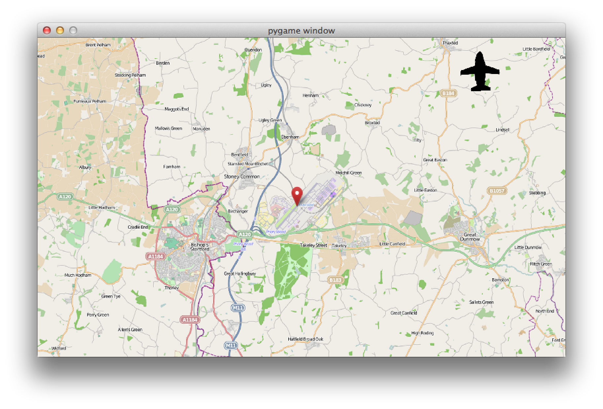

Py07 - Airport
===============

You'll be making a network game where you all try to land aeroplanes on one runway without crashing.

It should take about three weeks.

Week One
=========



This week we're going to make planes fly across the screen. In later weeks, we'll enable you to land the planes - and then make it into a network game.

Stage 1 - a blank airport
-----------------

* Create a new Python file called `airport.py`.
* In this class, create a class of sprites entitled `Plane`. This should be a type of `CodeClubFreeRotatingSprite`, and its `__init__` method needs to take an additional parameter called `screensize`:

```python
class Plane(codeclub.CodeClubFreeRotatingSprite):
        def __init__(self, screensize):
                codeclub.CodeClubFreeRotatingSprite.__init__(self)
                self.set_costume('plane_icon.png', 60)
                X_MAX = screensize[0]
                Y_MAX = screensize[1]
                # TODO - we'll fill in the rest of this __init__ method later
```

* After the class, fill in the main body of the game like this:

```python
def main():
        pygame.init()
        screensize = (800, 483)
        screen = pygame.display.set_mode(screensize)

        wallpaper = codeclub.load_image('stansted-map.png')
        wallpaper = pygame.transform.scale(wallpaper, (screensize))

        plane = Plane(screensize)
        allplanes = pygame.sprite.Group((plane))

        clock = pygame.time.Clock()

        while True:
                clock.tick(60)

                for event in pygame.event.get():
                        if event.type == QUIT:
                                return
                        elif event.type == KEYDOWN and event.key == K_ESCAPE:
                                return

                # TODO - move the plane

                screen.blit(wallpaper, (0, 0))
                allplanes.draw(screen)
                pygame.display.flip()

if __name__ == '__main__': main()
pygame.quit ()
```

* Run the game. What happens?
* Now add instructions for the plane to move where you've already typed `TODO - move the plane`. All types of CodeClub sprite have a method called `move` which takes a single parameter: the distance to move. This doesn't have to be a whole ("integer") number: it can be something like 0.5, 1.5, 3.674 or whatever you want. Pick some speed which you're happy with: you can change it later.
* Run the game. What happens now?

Stage 2 - Starting from a random location
---------------

The plane is starting in the corner. Let's fix it to start _anywhere on any edge of the screen_. You'll do this by adding code to the Plane's `__init__` method.

* Pick a random side of the screen to start on. (`edgenumber = random.choice((0,1,2,3))` might be what you want... don't forget you can use `print edgenumber` to find out what you got).
* Fill in two variables `x` and `y` to pick a random location along the edge. Hints:
  * You'll need to use `if edgenumber == 1:` and similar.
  * You'll need to use `X_MAX` and `Y_MAX`. If you're not sure what they are, look where the parameter to the `__init__` method comes from - when you create the `Plane` sprite in the main part of the script.
  * To pick a random number between 0 and, say, `Y_MAX` then use `y = int(random.random() * Y_MAX)`
* Move the plane to the right place using `self.move_to((x, y))`. We're using "self" because the script we're writing belongs to the plane - so the plane itself is telling itself to move.
* Test the game. It should start at a random location on any edge of the screen. It will still always fly left, but we'll fix that left.

Stage 3 - Flying into the screen
-----------------

Now we'll fix it so that the place flies into the middle of the screen. Again, you'll do this by modifying the Plane's `__init__` method.

* Create a new variable called `direction`. This should contain the direction (in degrees) where the plane should point. **Important:** 0 degrees is pointing *left*.
* Set the value of this variable depending on the side where the plane starts. We want it to choose a random direction between 0 and 180 degrees, but always pointing _into_ the map.
* For example, if the plane is on the left edge of the screen, we want to choose an angle from 90 to 270.
* Call `self.point_in_direction(direction)` to set the direction.
* Test the game. We should see a plane starting on one edge and flying across the screen in a random direction.


